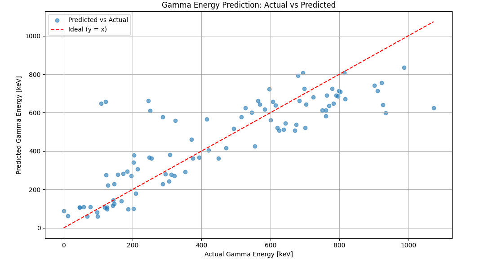

# Model Description
This model predicts gamma-ray transition energies for the Uranium-235 (U-235) isotope using nuclear level parameters:
- Start Level Energy [keV]
- Spin (J)
- Parity (π)

The model is trained on data extracted from the IAEA Nuclear Structure Database, transformed into a structured format suitable for machine learning. It employs a deep neural network with three dense layers (128-64-32 neurons) and ReLU activation functions.

## Performance

- **Mean Absolute Error (MAE): ~110 keV**
- This accuracy is considered highly reasonable for experimental gamma-ray predictions, as experimental uncertainties and nuclear level mixing often introduce variations in the same order of magnitude.
**Loss Function:** Mean Squared Error (MSE)
**Optimizer:** Adam
**Overfitting Prevention:** Early stopping with patience of 20 epochs

## Visual Test Summary

